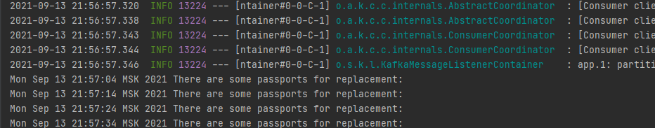

# job4j_managingPassports

### Описание проекта
Данный проект показывает ***виды взаимодействия микросервисов***. ***Синхронное взаимодействие и ассинхронное***. Синхронное осуществляется посредством ***Rest API***. Асинхронное - посредством ***Kafka*** как брокера сообщений. Сервис  PassportApiService в модуле managingPassports полностью копирует методы сервиса PassportServiceImpl через url-запрос. Асинхронное взаимодействие представляется меджу двумя модулями managingPassports и mail_service. На контроллер модуля managingPassports поступает запрос из браузера для проверки паспортов, подлежащих замене в ближайшие 3 месяца, и затем поступает ответ с сообщением о наличии или отстутствии в базе данных таких паспортов. Затем, если паспорта найдены, то сведения о них посылаются через брокер сообщений в сервис модуля mail_service, который извещает владельцев о предстоящей замене. Проверка происходит с помощью переодического запуска.

### Использованные технологии
* Kafka
* Java 14
* Spring Boot 2
* Spring Data JPA
* PostgreSQL
* Liquibase
* Maven
* Travis C.I.
* Checkstyle
* Jacoco

### Работа программы
#### Запуск микросервисов
1. Запускаем Kafka и Zookeeper

   

2. Запускаем микросервисы

   

3. Сервис посылает сообщения через Kafka

   

4. Сервис получает сообщения от Kafka

   